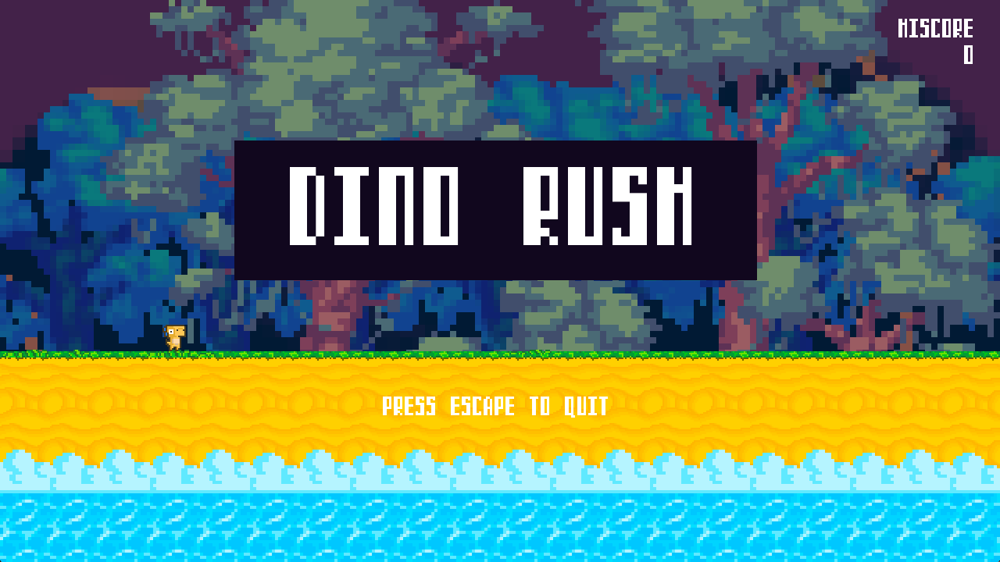
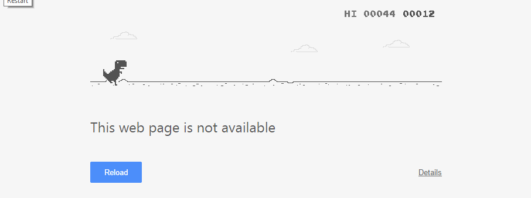
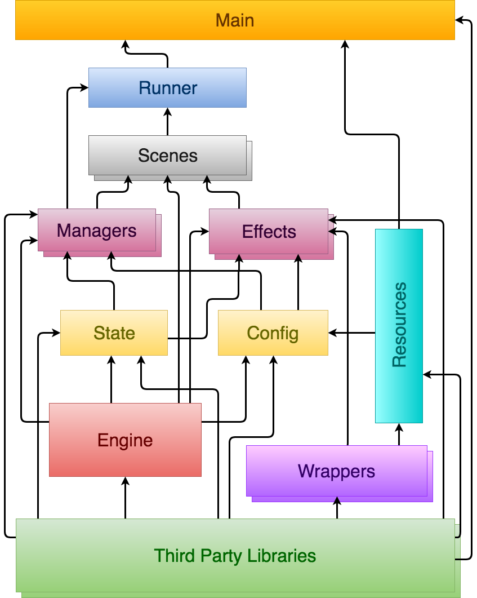
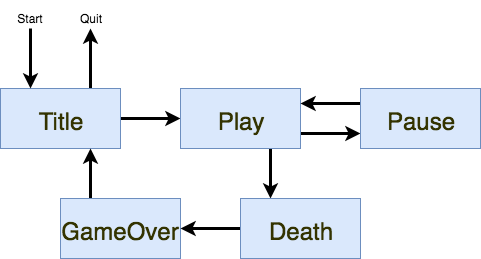
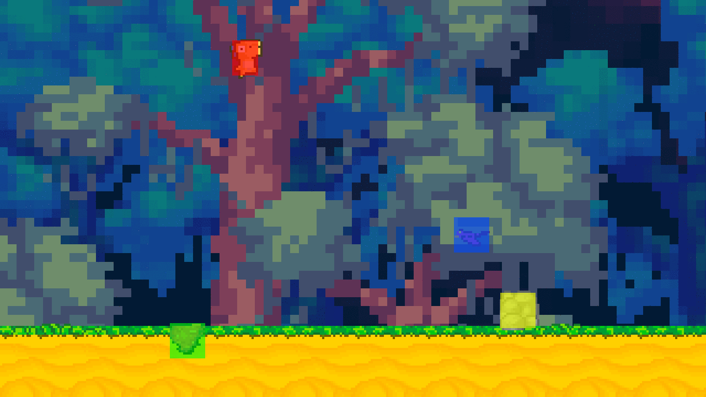

#A Game in Haskell - Dino Rush
#####  February 28, 2018

<center>
  

  [GitHub Repo](https://github.com/jxv/dino-rush)
</center>


## Motivation

Writing a game in Haskell appears to be an elusive, white-whale task.
And with an existing handful of small and citable games, I wish more existed with documentation to ease the barrier of entry.
It's disappointing because writing a game can be a challenging and fun way to explore a language.
And Haskell could be a great language for creating small-medium sized games.
Anything larger sounds like a [bad idea](https://np.reddit.com/r/rust/comments/78bowa/hey_this_is_kyren_from_chucklefish_we_make_and/doslvsb/).
Yet I haven't written a game with graphics in recent years.
Instead, I dug out increasingly larger chunks of programming knowledge with Haskell.
And that has given back more than originally expected.
It's been enough now, whereas I can take decent shot at a game and not be completely appalled by the code later.

Before embarking on a short and starry-eyed journey, it seemed easy to imagine such a codebase -- flaws included.
"Flaws."
I decidedly choose not to use FRP for example.
Nothing against FRP.
It's an interesting and high level way to operate with UIs, and perhaps I'll come back to it someday.
I don't know.
But for this project, it felt unwise to get caught up or side-tracked with explaining another concept.
This plate already holds a complete meal.

When imagining how to organize the big to small things, the flaws mentally accrue more than I can manage.
They can be only understood by doing it.
It definitely wasn't going to be perfect, and facing the imperfections would be a process.

At the very least, I wanted to create something exhaustive that I would have appreciated a couple years ago.
And the game must work at all costs.
The direction meant to satisfy these mindsets.
It's not the only way to write a game in Haskell.
There will always be more to learn and apply on this cliff that never seems to stop growing.
Without glancing at the latest extensions and most advanced libraries, Haskell still has plenty to offer.
Yeah.
Let's stick with that.

## The Game ([video](https://youtu.be/as4sKGoA7XI))

The game is called Dino Rush because the objective is for a dinosaur -- stay with me on this -- to rush past obstacles.
Sure, it's not very interesting from a design perspective.
And without a doubt, it's a Skinner box game.
It's <del>shamelessly stolen from</del> _inspired by_ a certain, offline game.
But it's fairly simple from a player perspective.
That's important for keeping scope.

<center>
  
</center>

Of course, it wasn't as straight forward from a programmer perspective.
That makes smartest decision overall was to pick a silly game.
Again, scope.
Plenty of time was spent getting the "foundation" to be functional before writing any gameplay.

<center>
  
</center>

Not surprisingly, the polishing and forming a coherent architecture took the most time.
Ha!
But they were both worthy causes.
The level of polish need to exist somewhere and somehow.
And the architecture must allow such things to be clear and easily expandable.
That's the point of a good architecture.

## Architecture

The architecture was extracted throughout the course of the development.
At a super high-level, the boxes below represent all the modules and types of modules that fit together.
It's a reusable model for many more games.
But it's just that -- a model.
Even Dino Rush doesn't adhere 100%, and that's okay.
It's awfully similar enough to demonstrate utility.

<center>
  
</center>

As you can see, all the arrows flow upwards.
A higher-level box gets pointed by lower-level boxes it depends on.
(There was likely an unconscious inspiration from a [Hexagon architecture](http://alistair.cockburn.us/Hexagonal+architecture) and previous games.
It's hard to know at this point.)

* **Main** - Do all the things!
* **Runner** - Main loop and scene state machine.
* **Scenes** - Represent pieces of a coherent story. Lots of glue code.
* **Effects** - Eventually IO actions. Impure.
* **Managers** - For state machines. Leans toward deterministic and likely pure.
* **Config** - Loaded read-only or referenced values. Mixed purity.
* **State** - Global stitching of all types in state. All pure.
* **Resources** - Types and functions for loading and freeing. (eg. textures, music)
* **Engine** - Most code. Game logic, physics, entities, commands. All pure!
* **Wrappers** - A place to wrap IO code which could use a cleaner API
* **Third Party Libraries** - All the dependencies (eg. `sdl2`, `linear`, `animate`)

## Main ([code](https://github.com/jxv/dino-rush/blob/master/library/DinoRush.hs))

Let's take it from the top.
At the [`main`](https://github.com/jxv/dino-rush/blob/master/library/DinoRush.hs#L39) function.
In general, it's important to keep the `main` function concise as possible.
When jumping into any codebase, not having clear indication where to dig into next feels pretty obnoxious.
Event if it's not intentional, and it's probably not.
It happens when intertwining setup, configuration, and miscellaneous IO actions.
Be sparse for kindness.

```
main :: IO ()
main = do
  SDL.initialize [SDL.InitVideo, SDL.InitAudio]
  Font.initialize
  Mixer.openAudio Mixer.defaultAudio 256
  window <- SDL.createWindow "Dino Rush" SDL.defaultWindow { SDL.windowInitialSize = V2 1280 720 }
  renderer <- SDL.createRenderer window (-1) SDL.defaultRenderer
  resources <- loadResources renderer
  mkObstacles <- streamOfObstacles <$> getStdGen
  let cfg = Config
        { cWindow = window
        , cRenderer = renderer
        , cResources = resources
        }
  runDinoRush cfg (initVars mkObstacles) mainLoop
  SDL.destroyWindow window
  freeResources resources
  Mixer.closeAudio
  Mixer.quit
  Font.quit
  SDL.quit
```

Good.

The function has 5 essential parts:

* Initialize the media libraries
* Load resources (Fonts, images, and sounds)
* Run the main loop
* Free the resources
* Uninitialize the media libraries and clean up shop

Because this isn't a large and memory intensive game, frequently loading and unloading resources at runtime isn't needed.
If it was, there's a place for that somewhere in the architecture -- either Effects or Managers.

### MTL Style and Lenses

Dino Rush's usage of __mtl style__, a pattern named after the [mtl](https://hackage.haskell.org/package/mtl) library, is the most technically complex part of the code.
If you're unfamiliar with this pattern, I highly suggest you stop here and go learn about it.
It's a game changer to be aware of and much bigger topic than this post.
And commonly aligned with __mtl style__, Dino Rush follows a (basic) use of lenses.

These links are more than exhaustive (eg. Free Monad isn't relevant):

* [What I Wish I Knew When Learning Haskell 2.3 ( Stephen Diehl )](http://dev.stephendiehl.com/hask/#mtl-transformers)
* ["Next Level mtl with Classy Optics" by George Wilson at BFPG](https://www.reddit.com/r/haskell/comments/3a2sse/next_level_mtl_with_classy_optics_by_george/)
* [Edward Kmett- Monad Transformer Lenses](https://www.reddit.com/r/haskell/comments/4v42mj/edward_kmett_monad_transformer_lenses/)
* [Monad transformers, free monads, mtl, laws and a new approach](https://ocharles.org.uk/blog/posts/2016-01-26-transformers-free-monads-mtl-laws.html)
* [Unit testing effectful Haskell with monad-mock](https://lexi-lambda.github.io/blog/2017/06/29/unit-testing-effectful-haskell-with-monad-mock/)

Hey! Did you just skip all of those links? Alright. Fine. Here's the skinny.

In order to have side-effects and still carry data around, __Monad Transformers__ are the way to go.
They compose useful monads like `StateT` and `ReaderT`, which carry the data around.

By wrapping the monad transformers in a newtype, the advantages of the transformers are retained by with the help of a language extension, `GeneralizedNewtypeDeriving`.
In reality, the typeclass instances are kept separated from `ReaderT`, `StateT`, and `IO`.

```
newtype DinoRush a = DinoRush (ReaderT Config (StateT Vars IO) a)
  deriving (Functor, Applicative, Monad, MonadReader Config, MonadState Vars, MonadIO, MonadThrow, MonadCatch)
```

Plus, it's a cleaner looking signature.

```
exampleSignature :: Int -> DinoRush ()
```

That's a lot easier to read and write than the underlying transformer stack.

The `DinoRush` monad can do `IO`, modify `Vars`, and access the `Config`.
Now, combine that with a function to run the transformer.

```
runDinoRush :: Config -> Vars -> DinoRush a -> IO a
runDinoRush config v (DinoRush m) = evalStateT (runReaderT m config) v
```

Bam!

The `DinoRush` monad can run in IO as if it wasn't wrapped.

But there's a problem here.
This is especially true if you care about isolating side-effects or testing.
Because `DinoRush` nests an `IO` underneath, there's no guarantee that any function has known side-effects.
And there's another problem.
Accessing the `Vars` state in `StateT` underneath `DinoRush` is nearly synonymous with managing global state.
As a program becomes larger, that can be an overwhelming rat nest.
It's everyone's favorite software problem.

Imagine if you can restrict which data accessed by the use of a type signature.
Because that's possible.
Like this:

```
updateDino :: (MonadState s m, HasPlayVars s, Renderer m, AudioSfx m) => Step DinoAction -> m ()
```

`updateDino` doesn't need to know or care that `s` is an amalgamation of other state.
It just knows what it cares about; it can access `PlayVars`.
This what the wonderful `mtl` and `lens` libraries allow.

The last thing to do is instance `HasPlayVars` on `Vars` and instance `Renderer` and `AudioSfx` on `DinoRush`.
The code achieves high cohesion with loose coupling. Great!

## Runner ([code](https://github.com/jxv/dino-rush/blob/master/library/DinoRush/Runner.hs))

The [`Runner`](https://github.com/jxv/dino-rush/blob/master/library/DinoRush/Runner.hs) is the module holds the main loop.
It provides 3 distinct purposes.
First, it steps the current `Scene`.
Second, it manages and effects the transitions between `Scene`s.
Last and just as important, it does the common functions that happen every frame -- polling input, drawing to the screen, and delaying the frame.
All of this runs inside the main loop.

I'll freely admit that `Runner` isn't the best name.
It's an overloaded term.
But I couldn't think of a better one!

```
mainLoop = do
  updateInput -- 1
  input <- getInput
  clearScreen -- 2
  clearSfx -- 3
  scene <- gets vScene
  updateQuake -- 4
  step scene -- 5
  playSfx -- 6
  drawScreen -- 6
  delayMilliseconds frameDeltaMilliseconds
  nextScene <- gets vNextScene
  stepScene scene nextScene -- 7
  let quit = nextScene == Scene'Quit || iQuit input || ksStatus (iEscape input) == KeyStatus'Pressed
  unless quit mainLoop
```

1. Poll and store the input

2. Clear out the screen for drawing

3. Clear out the list of sound effects to play. There's a type [`Sfx`](https://github.com/jxv/dino-rush/blob/master/library/DinoRush/Engine/Sfx.hs) that represents each sound effect.

4. Updates the state for an earthquake every 30 seconds.
   It's a convenient exception to the architecture model.
   This kind of detail wouldn't be here if different kind of scenes were added.

5. Behind the `step` function steps the current `Scene`.
   Each [`Scene`](https://github.com/jxv/dino-rush/blob/master/library/DinoRush/Engine/Scene.hs) has its own logic, sound, drawing, and dreams.
   Those are intentionally opaque.

   ```
    where
      step scene = do
        case scene of
          Scene'Title -> titleStep
          Scene'Play -> playStep
          Scene'Pause -> pauseStep
          Scene'Death -> deathStep
          Scene'GameOver -> gameOverStep
          Scene'Quit -> return ()
   ```

6. Once the scene step finishes, play sound effects on the list and redraw the screen.

7. This is an interesting bit.
   Because a scene needs to declare the next scene, there's a temptation to let the scenes form direct dependencies on each other.
   Scenes can be maintain flatness with indirection.
   They really shouldn't know much about each other in any case.
   So, there needs to be an intermediate step for transitions and one that ensures low complexity.
   That's done by forcing the transitions up into the `Runner`.
   The `Runner` knows all of the scenes, and let it handle the transitions.

   ```
    stepScene scene nextScene = do
      when (nextScene /= scene) $ do
        case nextScene of
          Scene'Title -> titleTransition
          Scene'Play -> case scene of
            Scene'Title -> playTransition
            Scene'Pause -> pauseToPlay
            _ -> return ()
          Scene'Death -> case scene of
            Scene'Play -> deathTransition
            _ -> return ()
          Scene'Pause -> case scene of
            Scene'Play -> playToPause
            _ -> return ()
          Scene'GameOver -> return ()
          Scene'Quit -> return ()
        modify (\v -> v { vScene = nextScene })
   ```

And visually represented.

<center>
  
</center>

## Scenes ([code](https://github.com/jxv/dino-rush/blob/master/library/DinoRush/Scene))

Remember that the next `Scene` is decided in the current `Scene`'s step.
It doesn't happen at the level of the `Runner`, which deals with the transitions as a result.

* **Title** - Waiting area before starting a game in `Play`
* **Play** - Scene for game play -- it encompasses the most code and the complexity to match
* **Pause** - Lower music and pause all gameplay and sprite animations
* **Death** - Wait until the dinosaur drops off the screen
* **GameOver** - Fade out to black and wait for a user input to return to the `Title` scene
* **Quit** - Exit

`Pause`, `Death`, and `GameOver` all access the same `Play` state, `PlayVars`.
Although they treat it as read-only access for drawing, that _breaks_ the mold of the proposed architecture.
It was an intentionally cut corner.
It was to avoid excessively data mapping as described in the `State` section below.

If there was another state-machine, representing sub-scenes within the `Play` scene, it would justify it.
The sub-scenes could share read-only access of each other.
It's hard to say, but I think that's where it was growing.

## Managers ([code](https://github.com/jxv/dino-rush/blob/master/library/DinoRush/Manager))

In the realm of __mtl style__, a Manager is a monadic type class representing an interface to hidden state.
Whatever touches that data is not responsible for how it manages it self.
Just stick with the interface.
They're abstract data types as derived by the CLU language.

Dino Rush has two -- `SceneManager`, the interface for the scene state machine, and `HasInput`, the interface for updating and accessing game input.
Each interface is capable of being mocked with pure types.

Each `Scene` imports the `SceneManager` in order to set the next scene.

```
class Monad m => SceneManager m where
  toScene :: Scene -> m ()
```

`HasInput` is a bit of state machine that accesses IO.
It's not really deterministic.
However, it's not outwardly effectful.
It's just reading of input and storage of input.
The interface is dumb.

```
class Monad m => HasInput m where
  updateInput :: m ()
  setInput :: Input -> m ()
  getInput :: m Input
```

Like sprite animation, detecting changes between key presses has been a pet peeve in other games.
I made the [`key-state`](https://hackage.haskell.org/package/key-state) library to generalize the same set of types and functions.

In the case of `updateInput`, SDL events are polled then adapted into the Dino Rush's idea of an input.
It's unique to the [Dino Rush domain](https://github.com/jxv/dino-rush/blob/master/library/DinoRush/Engine/Input.hs) as it's used through the `Engine`, `Scene`, and `Runner`.


```
updateInput' :: (HasInput m, SDLInput m) => m ()
updateInput' = do
  input <- getInput
  events <- pollEventPayloads
  setInput (stepControl events input)
```

The adaption happens inside `stepControl`.
By the key code, `next` helper function steps through the events deciding the next key state.

```
stepControl :: [SDL.EventPayload] -> Input -> Input
stepControl events Input{iSpace,iUp,iDown,iEscape} = Input
  { iSpace = next 1 [SDL.KeycodeSpace] iSpace
  , iUp = next 1 [SDL.KeycodeUp, SDL.KeycodeW] iUp
  , iDown = next 1 [SDL.KeycodeDown, SDL.KeycodeS] iDown
  , iEscape = next 1 [SDL.KeycodeEscape] iEscape
  , iQuit = elem SDL.QuitEvent events
  }
  where
    next count keycodes keystate
      | or $ map pressed keycodes = pressedKeyState
      | or $ map released keycodes = releasedKeyState
      | otherwise = maintainKeyState count keystate
    released keycode = or $ map (keycodeReleased keycode) events
    pressed keycode = or $ map (keycodePressed keycode) events
```

## Effects ([code](https://github.com/jxv/dino-rush/blob/master/library/DinoRush/Effect))

An `Effect` is also a monadic type class.
Unlike a `Manager`, whether they act as a state machine is irrelevant.
The purpose is to represent side-effects.

The `Renderer` type has side-effects.
It clears the screen, draws the screen, draws sprites, and draws numbers.

```
class Monad m => Renderer m where
  clearScreen :: m ()
  drawScreen :: m ()
  getDinoAnimations :: m (Animations DinoKey)
  ...
  drawDino :: DrawSprite DinoKey m
  ...
  drawNumber :: Number -> (Int, Int) -> m ()
```

It's a low-level `Effect` where some funcitons should be used to form clearer intentions.
Another `Effect`, `HUD`, does that by depending on `Renderer` in its implementation.

```
class Monad m => HUD m where
  drawHiscore :: m ()
  drawScore :: m ()
  drawControls :: m ()

drawHiscore' :: (Renderer m, MonadState s m, HasCommonVars s) => m ()
drawHiscore' = do
  cv <- gets (view commonVars)
  drawHiscoreText (1150, 16)
  drawNumbers (fromIntegral $ cvHiscore cv) (1234, 50)

drawNumbers :: Renderer m => Integer -> (Int, Int) -> m ()
drawNumbers int (x,y) = mapM_
  (\(i, n) -> drawNumber n (x - i * 16, y))
  (zip [0..] (toNumberReverse int))
```

Writing the code that controls the camera was actually pretty fun.

<center>
  
</center>

_Zoom, zoom._

```
class Monad m => CameraControl m where
  adjustCamera :: Camera -> m ()
  disableZoom :: m ()
  enableZoom :: m ()
```

An easy way to zoom with SDL is to modify the viewport.
With the `Camera` type and functions from the `Engine`, the `moveCamera` helper function was a quick stitch.

```
moveCamera :: MonadIO m => SDL.Renderer -> Camera -> m ()
moveCamera renderer Camera{camZoom, camOrigin} = do
  SDL.rendererScale renderer $= (fmap realToFrac camZoom)
  let dim = fmap truncate $ screenV2
  SDL.rendererViewport renderer $= (Just $ SDL.Rectangle (SDL.P $ (fmap truncate $ moveOrigin camOrigin)) dim)
  SDL.rendererClipRect renderer $= (Just $ SDL.Rectangle (SDL.P $ V2 0 0) dim)
```

Although, moving the camera isn't enough.
The HUD can't have zoomed viewport.
The images will scale off and around the screen.
Using a stored `Camera` value, zooming could be toggled.

```
disableZoom' :: (MonadIO m, MonadReader Config m) => m ()
disableZoom' = do
  renderer <- asks cRenderer
  moveCamera renderer initCamera

enableZoom' :: (MonadIO m, MonadReader Config m, MonadState Vars m) => m ()
enableZoom' = do
  renderer <- asks cRenderer
  cam <- gets vCamera
  moveCamera renderer cam
```

When re-enabling a zoom, the camera resumes from the stored `Camera`.

```
adjustCamera' :: (MonadIO m, MonadReader Config m, MonadState Vars m) => Camera -> m ()
adjustCamera' cam = do
  modify $ \v -> v { vCamera = cam }
  renderer <- asks cRenderer
  moveCamera renderer cam
```


### Managers versus Effects

Or Managers _and_ Effects.
I debated whether or not to split these into separate categories.
A case could be made to keep them merge into a single directory called `Class` or something similar.
But if game dev is art, and art is about intention, then these lines should be drawn like God intended.

## Config ([code](https://github.com/jxv/dino-rush/blob/master/library/DinoRush/Config.hs))

`Config` is the environment data inside the `ReaderT` transformer.
It's a basic use for a transformer, including with __mtl style__.
The data is always read-only while running a transformer stack.
However, there are exceptions with  `IORef`, `MVar`, and `TVar` which reference values.
They're need needed for performance and multi-threaded programs.

```
data Config = Config
  { cWindow :: SDL.Window
  , cRenderer :: SDL.Renderer
  , cResources :: Resources
  }
```

There's not much going on here, and that's good.
Just the SDL window, renderer, and various loaded resources.
It would also hold command-line related arguments if they were needed.
But they're not.

## State ([code](https://github.com/jxv/dino-rush/blob/master/library/DinoRush/State.hs))

The global stitched state is the `Vars` type.
Similar to appearance of scene transitions, they look opaque from this perspective.

```
data Vars = Vars
  { vCommon :: CommonVars
  , vScene :: Scene
  , vNextScene :: Scene
  , vTitle :: TitleVars
  , vPlay :: PlayVars
  , vGameOver :: GameOverVars
  , vInput :: Input
  , vCamera :: Camera
  } deriving (Show, Eq)
```

### To Duplicate or Not to Duplicate

Deciding whether or not to duplicate reused data was a careful balance.

It's clear that different scenes creates intentional boundaries between the updating of state.
But an issue arises is when a scene does the same stateful updates or reads the same state.
Should the scene only have access to its own state or a shared state?

An individualistic person would believe the "right" way feels that duplication is right. _So mind your business._

An group-oriented person would disagree. _Sharing is caring._

I kid with the stretched analogy, but the debate still remains the same.
Each scene represents a kind of "domain", and data originating outside that domain should be projected into it during transition.
The benefit is that each scene can evolve (or die) independently of another.
It's a solid lego block, but with an obvious cost.
The scalability requires significantly more data mapping between scenes.
It's trivial, boring, and time-consuming.

The counter argument is that the lego block goes against the DRY principle.
(I'm fairly hesitant to argue for that point anyways.)
I may be convinced that "a single source of truth" is valid.
This game isn't running over a network.
So why immediately complicate that?
And if problems arise, it could be refactored if need be -- YAGNI.
You'll need to be on the look out.

There's really two ways to do this.
The first, place the state behind a `Manager`.
It's likely overkill as __mtl style__ with `MonadState` is already the chosen route.
"Like I don't need any more type classes in my life."
It's an option though.

The second, which sounds more reasonable for simple getting and setting, is to be more fined grain with state.
This approach takes advantage of __mtl style__.
There is a single source of truth.
And it's a half-way compromise to the scene-based approach.

I'm not convinced there's a "right" way.
Using best judgement feels like the way to go right now.
And I know that I'd be satisfy with a plan or an idea how it could be refactored between each approach.
That's really the best principle.

### Common

Late in the development, I caved into creating explicit set of common state.
When every scene accessed these types, it could be an exception.

```
data CommonVars = CommonVars
  { cvHiscore :: Score
  , cvQuake :: Quake
  , cvSfx :: [Sfx]
  } deriving (Show, Eq)
```

`cvQuake` and `cvSfx` is modified in the mainLoop, and `cvHiscore` is drawn on every frame.
It still felt like betrayal in a functional language.
_Common state is the junk drawer._

In retrospect, `cvSfx` as common was valid but approached poorly.
It has a resemblance of `vInput`, and it should have used a similar `Manager` [`type class`](https://github.com/jxv/dino-rush/blob/master/library/DinoRush/Manager/Input.hs).

## Resources ([code](https://github.com/jxv/dino-rush/blob/master/library/DinoRush/Resource.hs))

The `Resources` type holds all the necessary images, sound effects, and music.
It's also in the same module for loading those images, sounds, and fonts.
Draw and configure textures.

`Resources` was appropriately extracted from the `Config` type and its module.
The resources required unique set of detailed instructions for loading and freeing.
The details became quite messy for `Config` in the same vein that `Main` should be concise.
`Config` is concerned about all read-only at a higher level.

### Sprites & Animations

With 2D games, a sprite system can save a lot of repetitive work.


To load sprite sheets and manage animations, I used my [animate](https://hackage.haskell.org/package/animate) library.
The majority of sprites aren't super complicated and can be described along a pattern.
Using with a helpful JSON loader, the process of writing sprite loaders and editing can be done trivially.

```
Animate.readSpriteSheetJSON loadTexture "resource/dino.json" :: IO (Animate.SpriteSheet DinoKey SDL.Texture Seconds)
```

Because __animate__ doesn't know about __SDL__, `loadTexture` is passed in as callback function which needs to load a `SDL.Texture`.
Most of instructions for forming the animated sprite are in the JSON file.

```
{
  "image": "resource/dino.png",
  "alpha": [255,0,255],
  "clips": [
    [   0, 0, 48, 48],
    [  48, 0, 48, 48],
    [  96, 0, 48, 48],
    [ 144, 0, 48, 48],
    [ 192, 0, 48, 48],
    [ 240, 0, 48, 48],
    [ 288, 0, 48, 48],
    [ 336, 0, 48, 48],
    [ 384, 0, 48, 48],
    [ 432, 0, 48, 48],
    [ 480, 0, 48, 48],
    [ 528, 0, 48, 48],
    [ 576, 0, 48, 48],
    [ 624, 0, 48, 48],
    [ 672, 0, 48, 48],
    [ 720, 0, 48, 48],
    [ 768, 0, 48, 48],
    [ 816, 0, 48, 48],
    [ 864, 0, 48, 48],
    [ 912, 0, 48, 48],
    [ 960, 0, 48, 48],
    [ 1008, 0, 48, 48],
    [ 1056, 0, 48, 48],
    [ 1104, 0, 48, 48]
  ],
  "animations": {
    "Idle": [ [0,0.2], [1,0.2], [2,0.2], [3,0.2] ],
    "Move": [ [4,0.01], [5,0.01], [6,0.01], [7,0.01], [8,0.01], [9,0.01] ],
    "Kick": [ [10,0.1], [11,0.1], [12,0.1] ],
    "Hurt": [ [13,0.05], [14,0.05], [15,0.05], [16,0.05] ],
    "Sneak": [ [17,0.01], [18,0.01], [19,0.01], [20,0.01], [21,0.01], [22,0.01], [23,0.01] ]
  }
}
```

* `image` is the file path of the sheet
* `alpha` is an optional tuple for color key representing transparency
* `clip` is an array of tuples [x,y,w,h] representing a clipped rectangle on the sheet
* `animations`, which is keyed by the animation key, holds lists of frames of the clip index and value for delaying (seconds in this case).

The animation key is one cool Haskell-ly thing about the __animate__ library.
The key is left opened as type parameter for user defined algebraic data types.
[`DinoKey`](https://github.com/jxv/dino-rush/blob/master/library/DinoRush/Engine/Dino.hs#L31) is one used here.

```
data DinoKey
  = DinoKey'Idle
  | DinoKey'Move
  | DinoKey'Kick
  | DinoKey'Hurt
  | DinoKey'Sneak
  deriving (Show, Eq, Ord, Bounded, Enum)
```

Each of the keys needs to map over to text in order to satisfy `KeyName` type class.

```
instance Animate.KeyName DinoKey where
  keyName = dinoKey'keyName

dinoKey'keyName :: DinoKey -> Text
dinoKey'keyName = \case
  DinoKey'Idle -> "Idle"
  DinoKey'Move -> "Move"
  DinoKey'Kick -> "Kick"
  DinoKey'Hurt -> "Hurt"
  DinoKey'Sneak -> "Sneak"
```

### Music & SFX

The `Mixer.load` function has a neat interface from the `Mixer.Loadable` type class.

```
class Loadable a where
  decode :: MonadIO m => ByteString -> m a
  load :: MonadIO m => FilePath -> m a
  free :: MonadIO m => a -> m ()
```

`Loadable` is used for both the `Music` type and the `Chunk` type, the sound effect type.
So while the statements look the same, the types are inferred differently.

```
  gameMusic <- Mixer.load "resource/v42.mod"
  jumpSfx <- Mixer.load "resource/jump.wav"
```

### Surface & Texture

Moving from SDL to SDL 2, the concept of `Texture` was introduced.
Previously, only a `Surface` type was used for rendering onto a buffer.
`Texture` is the result of hardware acceleration from GPU based libraries (OpenGL) are widely standardized and supported.
When SDL was first released, that wasn't true.

With SDL 2, render with `Texture`.
However, you're still stuck with loading image file as a `Surface`,

```
loadSurface :: FilePath -> Maybe Animate.Color -> IO SDL.Surface
loadSurface path alpha = do
  surface <- Image.load path
  case alpha of
    Just (r,g,b) -> SDL.surfaceColorKey surface $= (Just $ V4 r g b 0x00)
    Nothing -> return ()
  return surface
```

With a quick wrapper function, they'll convert into `Texture`s.

```
    loadTexture path c = SDL.createTextureFromSurface renderer =<< loadSurface path c
```

### Fonts

When drawing text onto a screen, it's a 2-step preparation process.

1. Load the font with the SDL ttf library and define the font size by pixel height.
2. Draw a string of text creating a `Surface` and convert the `Surface` into a `Texture`.

Drawing the `Texture` is no different than drawing any other `Texture`s at runtime.
Just render it.

To be honest, it felt awkward and wasteful to create an entirely new texture for a string of text.
The given interface encourages that.

Surely the reasons err on memory constraints.
I'm not a fan, but I haven't dug much into an alternative.
_Boo me._
From previous knowledge, I'm aware of font maps, but there was a readily available and elegant way to draw text dynamically at runtime.
One which doesn't care or know the font size at startup and resizes as needed.
I'd assume that clever caching is involved.

## Engine ([code](https://github.com/jxv/dino-rush/blob/master/library/DinoRush/Engine))

If there's something where Haskell really shines, it's doing data transformations.
And `Engine` is the place all about data transformations.
Fortunately, it's where most of the intricate code exists.
And every part of the game depends on it.
It's the center of what is.
Things in here are pure.
It's really something that was done correctly.

### Physics & Collision Detection

<center>
  
</center>

The collision detection is pretty simple.
It's just checking for an intersection between AABB types.
Things don't bounce off each other and fly away.
Anything more advanced than a quick test is completely unnecessary.
Plus, I attempted two separate mediocre physics engines ([1](https://github.com/jxv/platformer) & [2](https://github.com/jxv/merus)) years ago, but this time around there wasn't obvious value to it.
So I kept it easy.

### Entities

Most games have a concept of an Entity.
Perhaps they have an entire framework or library for dealing with entities.
Entity Component System is the term.
Or ECS for short.

I intentionally did not go that route.

For one reason, they're known to be difficult in Haskell.
Haskell doesn't inherit the same way as the other languages where is a ECS normal.
Advanced type wrangling needs to be done to be almost comparable.

For another reason, I'm not quite sold on the idea.
I understand it saves time by allowing things to be _super_ flexible and dynamic.
But I like the predictability and clarity of sum types or explicitly different types.

And worst case [GADTs](https://en.wikibooks.org/wiki/Haskell/GADT) can come to the rescue when sum types need more flexibility.

### Adapters & Commands

As mentioned before, the `Input` type is a type only pertains to Dino Rush.
It's a projection from the SDL event types.
This isn't a unique situation where that pattern occurs.

The `Sfx` type follows the same idea but outwards.
Rather than passing around a `Mixer.Chunk`, a `Sfx` is passed around.
Eventually, the appropriate mapping from the `Sfx` type to playing the chunk occurs in an [incredibly dull fashion](https://github.com/jxv/dino-rush/blob/master/library/DinoRush/Effect/Sfx.hs).

```
playSfx' :: (Audio m, HasCommonVars s, MonadState s m) => m ()
playSfx' = do
  CommonVars{cvSfx} <- gets (view commonVars)
  forM_ cvSfx $ \sfx -> case sfx of
    Sfx'Jump -> playJumpSfx
    Sfx'Duck -> playDuckSfx
    Sfx'Point -> playPointSfx
    Sfx'Bird -> playBirdSfx
    Sfx'Hurt -> playHurtSfx
    Sfx'Lava -> playLavaSfx
    Sfx'Quake -> playQuakeSfx
    Sfx'Rock -> playRockSfx
    Sfx'Recover -> playRecoverSfx
    Sfx'Stock -> playStockSfx
```

### Laziness

Sometimes, laziness can be awesome.
The obstacles and their placements are randomly generated into a list, which is a stream because it's freaking lazy!

```
streamOfObstacles :: RandomGen g => g -> [(Int, ObstacleTag)]
streamOfObstacles g = zip (map (\dist -> dist `mod` 18 + 3) $ randoms g) (randoms g)
```

Watch your step.
I may just generate a Fibonacci sequence to celebrate.

_1, 1, 2, 3, 5, 8, ..._

## Wrappers ([code](https://github.com/jxv/dino-rush/blob/master/library/DinoRush/Wrapper))

Occasionally, I'll come across a piece of irreducibly complex IO code.
They can't be mocked or tested in another way easily.
Usually, there's an under-exported newtype involved with smart constructors.

It's often not worth exposing that kind of [trouble](https://www.reddit.com/r/haskell/comments/7gfw3v/how_to_unit_test_code_that_uses_polymorphic/) through out the rest of the codebase.
So try to keep those troublemakers isolated in `Wrappers`, `Resources`, or `Main`.

Other times, the provided API could use a little adjustment for my usage.

```
class Monad m => SDLInput m where
  pollEventPayloads :: m [SDL.EventPayload]

pollEventPayloads' :: MonadIO m => m [SDL.EventPayload]
pollEventPayloads' = liftIO $ map SDL.eventPayload <$> SDL.pollEvents
```

I'm not picking on `sdl2` package.
There's just nor much else in the `Wrapper`s.
The bindings' API are obviously well thought out as they integrate nicely with existing libraries like `linear`, `vector`, and `lens`.
Big Kudos!

## Conclusion

This was a small learning experience which I felt pushed.
Yet there's a couple things, which I could have done differently, during development without needing hindsight.
Both are related to discipline.

Once the `Scene` idea became real,
I should have been more strict with keeping the `Scene` modules focused on its purpose.
The purpose is to compose functions from the other modules -- `Engine`, `Manager`, and `Effect` -- which forms a concise and coherent interaction of widely originating components.
Frequently, I'd extract something to be pure.
And more functions were created related to that function.
Next thing you know it, there's several potentially pure functions which should be in `Engine`.

Another thing is that I should have been more eager to create an `Effect`.
It can feel expensive to create another type class or module.
But for the sake of clarity, it's worth it.

Overall, I'm actually happy with the result as it achieves its main goal.
It's a Haskell game that plays on my small laptop.
The game generates enough sense of urgency to be "fun."
I watched a few people played it, and they seem to enjoy it.
That was very cool.

Thanks for reading!

<br/>

P.S. My high score is [227](2018-02-28-A-Game-in-Haskell/dino-rush-hiscore.png).

<br/>

[/r/haskell](https://www.reddit.com/r/haskell/comments/813yik/a_game_in_haskell_dino_rush/)

[/r/gamedev](https://www.reddit.com/r/gamedev/comments/8140hj/a_game_in_haskell_dino_rush/)

<br/>

---

## Acknowledgements

* Various contributors for the Haskell bindings of SDL libraries
    * [SDL2 bindings](https://github.com/haskell-game/sdl2/graphs/contributors) - Just looking at the commits, years of work have been put into the bindings. Dino Rush wouldn't exist without it. [Gabríel Arthúr Pétursson](https://github.com/polarina) and [Oliver Charles](https://github.com/ocharles) are especially noteworthy.
    * [SDL2 mixer bindings](https://github.com/sbidin/sdl2-mixer/graphs/contributors) - by [Vladimir Semyonov](https://github.com/tempname11) and [Siniša Biđin](https://github.com/sbidin), who fixed recent compiling issues.
    * [SDL2 ttf bindings](https://github.com/haskell-game/sdl2-ttf/graphs/contributors) - Commits show that [Siniša Biđin](https://github.com/sbidin) was killing it again.
* [draw.io](https://www.draw.io) - It's the simple diagramming software I always wanted. And it's free!
* Game assets were plucked from or created by various sources on the internet
    * Music
        * Goodie (Crack Intro) by Quartex (Oberheim)

    * Sound effects were generated by [bfxr](https://www.bfxr.net/)

    * Fonts
        * [Computer Speak](https://fontlibrary.org/en/font/computer-speak#Computer%20Speak%20v0.3-Regular) by Shaan Sawrup

    * Sprites
        * Dinosaur by [ScissorMarks](https://twitter.com/ScissorMarks)
        * [Water, ground, and rocks](https://opengameart.org/content/basic-map-32x32-by-silver-iv) by [Ivan VOIROL](https://opengameart.org/users/silver-iv)
        * [Lava](https://opengameart.org/content/lpc-terrain-repack) by [William Thompson](http://williamthompsonj.blogspot.de/)
        * [Trees](https://opengameart.org/content/jungle-tree-pack) by [KnoblePersona](https://opengameart.org/users/knoblepersona)
        * [Raven](https://opengameart.org/content/owl-and-raven-sprites) by [Revangle](https://revangale.wordpress.com/)